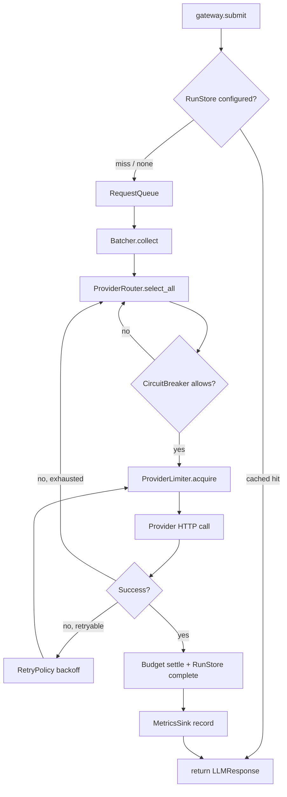

# Architecture

A map of the code for someone opening this repo for the first time. It walks
one request through the system, then lists the pieces and the ideas behind
them.

## One request, start to finish

Call `gateway.submit(request)` (`LLMGateway.submit` in
`src/llm_gateway/gateway.py`). Here is what happens, in order:

1. **Optional store check.** If the gateway was built with a `RunStore`
   (`_submit_with_store` in `gateway.py`), it first checks
   `store.get_response(key)` where `key = idempotency_key(request)`
   (`src/llm_gateway/store.py`). A hit returns the cached answer immediately,
   no network call. A miss calls `store.reserve(request, key)` to mark the
   row `in_flight` in SQLite before doing any work, so a crash mid-call is
   recoverable on the next run.

2. **Queue.** `_submit_uncached` wraps the request in a `QueuedRequest`
   (`src/llm_gateway/types.py`) with a fresh `asyncio.Future`, and puts it on
   `self.queue`, a `RequestQueue` (`src/llm_gateway/queue.py`). This is a
   max-heap keyed by `(-priority, seq)`, so higher-priority requests come out
   first and equal-priority ones stay FIFO. `submit()` then just awaits the
   future.

3. **Dispatcher loop.** A background task, `LLMGateway._loop` in
   `gateway.py`, repeatedly calls `self.batcher.collect(self.queue)`.

4. **Batcher.** `Batcher.collect` in `src/llm_gateway/batching.py` blocks for
   the first request, then keeps pulling more from the queue until the batch
   hits `max_batch_size`, `max_batch_tokens`, or the oldest member has waited
   `max_wait_ms`, whichever comes first. Requests with different hard
   capability needs (logprobs, strict JSON) are pulled off the queue but set
   aside and put back rather than mixed into an incompatible batch.

5. **Router.** `LLMGateway._dispatch` builds one composite `LLMRequest`
   describing the batch's hardest requirements (`_composite`) and calls
   `ProviderRouter.select_all` in `src/llm_gateway/routing.py`. This does
   capability filtering (`_capability_miss`: logprobs, strict JSON, context
   window), then health filtering (`provider.breaker.allows_request()`),
   then ranks survivors by rate-limit headroom band, then cost, then
   configured priority (`_score`).

6. **Circuit breaker.** Each `Provider` (`src/llm_gateway/providers/base.py`)
   owns a `CircuitBreaker` (`src/llm_gateway/breaker.py`). The router already
   excluded providers with an open breaker; on a retry within the same
   provider, `_call_with_retry` in `gateway.py` also calls
   `provider.breaker.check()` before each attempt after the first, which
   raises `CircuitOpenError` if the provider tripped mid-retry.

7. **Rate limiter.** Still inside `_call_with_retry`, the gateway awaits
   `provider.limiter.acquire(len(requests), n_tokens)`. `ProviderLimiter` in
   `src/llm_gateway/rate_limit.py` holds two independent `TokenBucket`s (one
   for requests/minute, one for tokens/minute) and blocks until both have
   enough. After every response, `sync_from_headers` can correct the bucket
   counts from the provider's own `x-ratelimit-*` headers, and if the
   gateway was built with `adaptive=True`, `on_throttled()` /
   `on_success()` halve or nudge up the request bucket's rate (AIMD) for
   providers that send no headers at all.

8. **Provider HTTP call.** `Provider.complete` / `Provider.complete_batch_settled`
   in `providers/base.py` acquire a concurrency slot
   (`asyncio.Semaphore`) and call the underlying client, `MockClient`
   (`providers/mock.py`), or `OpenAICompatibleClient` and its Groq/OpenRouter
   subclasses (`providers/http.py`, `providers/groq.py`,
   `providers/openrouter.py`) for real HTTP.

9. **Retry policy.** Back in `_call_with_retry`, each failed result is
   checked with `RetryPolicy.should_retry` (`src/llm_gateway/retry.py`)
   against status code and attempt count. If retryable, `delay_for`
   computes an exponential-backoff-with-full-jitter delay (overridden
   upward by a `Retry-After` header if present), the loop sleeps, and tries
   again. If a provider's whole attempt fails outright, the leftover
   entries move to the next candidate provider from the router's ranked
   list (failover).

10. **Store / budget settle.** On success, if a `BudgetLedger`
    (`src/llm_gateway/budget.py`) reservation was made for this request
    before dispatch, it is settled with the real cost
    (`reservation.settle`). If a `RunStore` is in use, the outer
    `_submit_with_store` calls `store.complete(key, response, cost=...)` to
    durably record the answer (or `store.fail` on an exception).

11. **Metrics.** Throughout, `MetricsSink` (`src/llm_gateway/metrics.py`)
    records attempts, successes, failures by class, retries, blocked time,
    batch sizes, and cost per provider.

12. **Response.** The entry's `asyncio.Future` is resolved with the
    `LLMResponse`, and `submit()`'s `await entry.future` returns it to the
    caller (subject to `request.timeout_s`, enforced with
    `asyncio.wait_for` around the whole path).

## Diagram

## File map

| File | Job | Lines |
|---|---|---|
| `gateway.py` | Wires queue, batcher, router, limiter, retry, and provider calls together; owns the dispatch loop | ~580 |
| `queue.py` | Priority (max-heap) async queue of pending requests | ~80 |
| `batching.py` | Groups queued requests into batches by size, tokens, or wait time | ~110 |
| `routing.py` | Filters providers by capability and health, ranks survivors | ~130 |
| `breaker.py` | Per-provider circuit breaker state machine | ~110 |
| `rate_limit.py` | Token-bucket rate limiting, header sync, AIMD adaptive mode | ~400 |
| `retry.py` | Classifies failures as retryable, computes jittered backoff | ~130 |
| `budget.py` | Reserve-then-settle spending ceiling in USD and tokens | ~300 |
| `store.py` | SQLite-backed idempotent, resumable request/response log | ~280 |
| `metrics.py` | In-memory counters, latency percentiles, and a text report | ~170 |
| `types.py` | Shared dataclasses (`LLMRequest`, `LLMResponse`, ...) and exceptions | ~180 |
| `cli.py` | `llm-gateway` command-line entry point (`run` and `models`) | ~880 |
| `providers/base.py` | `Provider`: pairs a client with its own limiter, breaker, and concurrency cap | ~140 |
| `providers/mock.py` | In-process fake provider used by the whole test suite | ~230 |
| `providers/http.py` | Generic OpenAI-compatible HTTP client (needs `httpx`) | ~330 |
| `providers/groq.py` | Groq-specific client/provider factory built on `http.py` | ~140 |
| `providers/openrouter.py` | OpenRouter-specific client/provider factory built on `http.py` | ~150 |

## Key ideas in plain words

**Token bucket.** A container that holds up to `C` "tokens" and refills at
`r` tokens per second, computed lazily from elapsed time rather than a
background timer. Sending a request costs tokens. This lets a caller burst
up to the full bucket, then settles down to the sustained rate, the same
shape most providers use for their own limits.

**Jitter backoff.** When a retry is due, wait `base * 2^attempt` seconds,
capped, then pick a random point between 0 and that number instead of the
number itself. Without the randomness, many clients that failed at the same
moment would all retry at the same moment too, recreating the overload they
just backed off from.

**Circuit breaker.** After enough consecutive failures from a provider, stop
sending it anything for a while (fail fast instead of waiting out five
retries per request). After a cooldown, let exactly one trial request
through; if it works, resume normal traffic, if not, stay shut for another
cooldown.

**Batching.** Instead of sending each prompt as its own network round trip,
collect several that arrived close together and send them as one call,
bounded by a size limit, a token limit, and a maximum wait time so no
request waits forever.

**Capability routing.** Not every provider can do everything (return token
probabilities, enforce a strict JSON schema, hold a huge context). Requests
that need something specific are only ever sent to providers that can
actually deliver it, this is a strict filter, never just a preference,
because a provider silently ignoring a requirement is worse than an error.

**At-least-once store.** A local database remembers which prompts have
already been answered so a crashed run can resume without re-paying for
everything. It is willing to occasionally call a provider twice for the same
prompt (a duplicate) rather than ever silently lose a result.

**Budget reservation.** Before a request is sent, the system sets aside its
worst-case possible cost from a spending ceiling, so several requests
starting at once can't all check "is there room?" against the same stale
number and collectively overspend. Once the real cost is known, the
reservation is replaced with the actual amount.

**Adaptive rate (AIMD).** For providers that don't tell you their limits in
response headers, the system guesses: cut the sending rate in half the
moment it gets rejected (multiplicative decrease), then creep the rate back
up a little after each success (additive increase). Same idea TCP uses to
avoid overloading a network.

## Where to start reading

1. `src/llm_gateway/types.py`, the shared vocabulary (`LLMRequest`,
   `LLMResponse`, exceptions).
2. `src/llm_gateway/gateway.py`, the whole request lifecycle in one file;
   read `submit`, `_loop`, `_dispatch`, and `_call_with_retry` in that order.
3. `src/llm_gateway/queue.py` and `batching.py`, how work accumulates
   before it goes anywhere.
4. `src/llm_gateway/routing.py` and `providers/base.py`, how a provider is
   chosen and what it looks like from the gateway's side.
5. `src/llm_gateway/rate_limit.py`, `breaker.py`, `retry.py`, the three
   protective layers around each call. `rate_limit.py`, `retry.py`,
   `batching.py` and `routing.py` each have a matching `*.EXPLAIN.md` design
   note in the same directory.
6. `src/llm_gateway/budget.py` and `store.py`, optional add-ons for
   long-running, resumable, cost-bounded sweeps.
